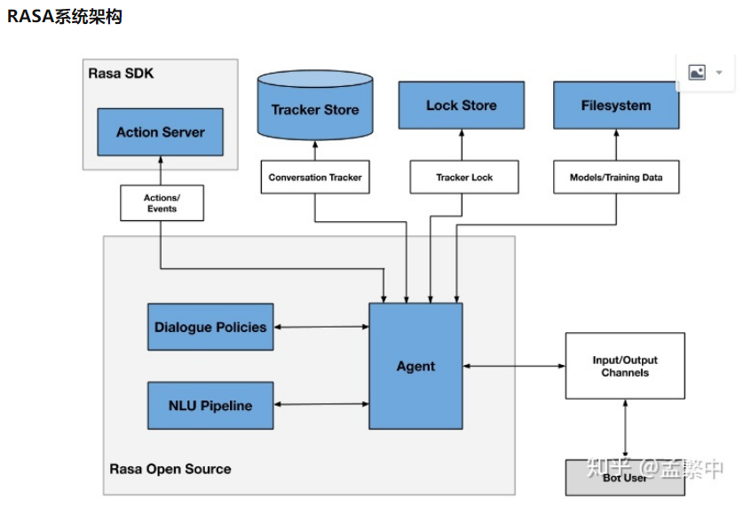
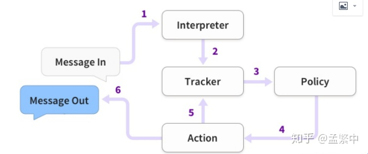
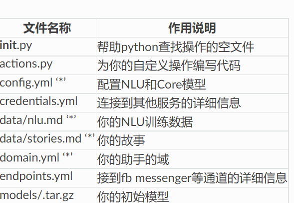

#### What - 什么是 rasa

rasa 的架构如下。



RASA包含自然语言理解（NLU）和对话管理（DM）两个主要组件。这里介绍一部分组件

- Rasa NLU 理解用户的对话，提取出感兴趣的信息 (如意图分类、实体提取等)，以pipeline的方式处理用户对话，在config.yml中配置。
- Dialogue Policies（对话规则） 根据NLU输出的信息、以及Tracker记录的历史信息，得到上下文的语境：预测用户当前最可能表达的意图；决定对话中每一步执行哪一个action（**根据对话上下文决定下一步对话**）。

- Agent组件，从用户来看，Agent就是整个RASA系统的代理，它接收用户输入消息，返回Rasa系统的回答。在Rasa系统内，Agent就是一个总控单元，它引导系统启动，它连接NLU和DM，得到Action，然后调用Action得到回答，它保存对话数据到数据存储。

- Tracker Store是对话的存储单元，将用户和机器人的对话保存在Tracker Store中。

  

  

  rasa 的消息处理过程如下：

  

  1. 消息传入后，被 Interpreter 接收

  2. Interpreter 接收消息后，将消息转换成字典（tokenizer），并转化成特征（featurizer），提取命名实体（Extractors），识别意图（Classifier）。这部分叫做自然语言理解（NLU）。interpreter将输出包括实体，意图，以及对话的特征一起传给Tracker。

     （省流：Interpreter 接收消息，NLU 分析消息，Interpreter 再将分析的结果传给 Tracker）

  3. Tracker 用来追踪记录对话状态的对象，Tracker的当前状态（特征，意图，实体）以及历史状态信息一并传给 Policy。

  4. Policy 将当前状态以及历史状态一并特征化，并传入预测模型（Policy），预测模型预测出下一个动作（Action）。

     （Policy 根据之前的对话和对话规则给出要执行的动作）

  5. Action 完成实际动作，并将动作结果通知到 Tracker，成为历史状态。

  6. Action 将结果返回给用户。

#### How - 怎么用 rasa

rasa 创建新项目

```shell
rasa init --no-prompt
```

该命令创建rasa项目所需的所有文件，并根据一些示例数据训练一个简单的机器人。

创建的文件如下：



最重要的文件用“`*`”标记。

yml 可理解为规范表示数据的格式，有关 .yml 文件的介绍 [两分钟带你了解YAML（.yml后缀文件） - 知乎 (zhihu.com)](https://zhuanlan.zhihu.com/p/433176170)


各模块介绍：

- nlu.yml（nlu.md）

  nlu.yml 配置训练数据：实体识别的训练数据需要将文本里的实体内容用[]括起，后面接其所属的实体名字(entity_name)，如

  ```yaml
  - intent: 手机产品介绍   
    examples: |     
      - 这款手机[续航](property)怎么样呀？
  ```

  

- responses.yml 

  提供bot在各种类型下的响应，预设定好的内容，不需要执行代码或返回事件。和actions中的response对应，定义格式为utter_intent。

  ```yaml
  responses:   
    utter_greet:   
    - text: "今天天气怎么样"                       #添加文字
      image: "https://i.imgur.com/nGF1K8f.jpg"        #添加图像
  ```

  

- stories.yml

  story文件定义了聊天流程模板，多轮对话按照模板进行对话，story中有意图和行为，意图决定了返回什么行为。意图由用户提供，行为由系统决定。如下

  ```yaml
  - story: happy path
    steps:
    - intent: greet
    - action: utter_greet
    - intent: mood_great
    - action: utter_happy
  
  ```

  story 表示标题，intent 表示意图， action 表示行为

- domain.yml

  domain.yml 中的内容要与stories.yml 中的内容对应上

  - intents表示意图
  - actions表示行为
  - templates模板

  


#### 参考资料

[Rasa 教程 - Rasa 聊天机器人中文官方文档|磐创AI (rasachatbot.com)](https://www.rasachatbot.com/2_Rasa_Tutorial/)

[（二）RASA开源引擎介绍 - 知乎 (zhihu.com)](h

[[rasa 介绍文档 - 知乎 (zhihu.com)](https://zhuanlan.zhihu.com/p/461729554)ttps://zhuanlan.zhihu.com/p/331806270)